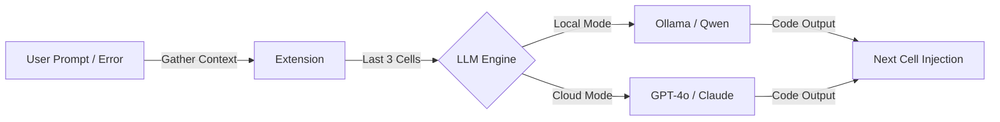

# 🚀 JupyterPilot: Agentic Research Environment

**JupyterPilot** is a secure, high-performance AI coding partner for JupyterHub. It decouples the Hub from execution via an SSH-based "teleport" logic and provides an agentic loop for natural language coding and real-time error healing.

---

## 🗺️ System Flow Diagram

### Infrastructure & Spawning Flow


### Agentic Loop Flow (%do / %fix)


---

## 🏗️ Phase-Wise Implementation

### Phase 0: Robust Infrastructure
The foundation focuses on secure, resilient multi-tenant isolation via SSH.
- **Dynamic Mapping**: Resolves user groups to remote servers via `user_mapping.json`.
- **Port Resilience**: Automated `netstat` checks and `fuser` cleanup before spawning.
- **Graceful SSH Cleanup**: SIGTERM-first shutdown logic for remote resource release.
- **Strict OAuth**: Forced domain enforcement and admin privacy controls.

### Phase 1: Provider-Agnostic LLM Engine
A flexible brain that swaps between local speed and cloud intelligence.
- **Hybrid Support**: Toggle between local **Ollama (Qwen2.5-Coder)** and cloud **LiteLLM (GPT-4o/Claude)**.
- **Hierarchical Config**: Prioritizes `~/.jupyterpilot/config.json` for user-specific choice.
- **High-Performance Inference**: Optimized prompts for zero-explanation, code-only output.

### Phase 2: Interactive Magic Commands
The agentic interface that lives inside your notebook.
- **`%do <prompt>`**: Natural language to code transformation.
- **`%fix`**: Post-mortem error analysis and healing using `sys.last_traceback`.
- **State Awareness**: Maintains variable names and logic flow by injecting the last 3 cells into every prompt.

---

## 📦 Installation Guide

The JupyterPilot extension works on any system running IPython/Jupyter (Mac, Linux, Windows).

### 1. Prerequisites
- **Python 3.8+**
- **Requests**: `pip install requests`
- **LiteLLM** (Optional, for cloud mode): `pip install litellm`
- **Ollama** (For local mode): [Download here](https://ollama.com/)

### 2. Deployment by Operating System

#### 🍎 macOS (Homebrew or Standard)
```bash
# Create startup directory
mkdir -p ~/.ipython/profile_default/startup/
# Install extension
cp jupyterpilot_extension.py ~/.ipython/profile_default/startup/
# Create user config
mkdir -p ~/.jupyterpilot
```

#### 🐧 Linux (Ubuntu/Debian/CentOS)
```bash
# Create startup directory
mkdir -p ~/.ipython/profile_default/startup/
# Install extension
cp jupyterpilot_extension.py ~/.ipython/profile_default/startup/
```

#### 🪟 Windows (PowerShell)
```powershell
New-Item -ItemType Directory -Force -Path "$HOME\.ipython\profile_default\startup"
Copy-Item "jupyterpilot_extension.py" -Destination "$HOME\.ipython\profile_default\startup\"
```

### 3. Configuration
Create a config file at `~/.jupyterpilot/config.json`:
```json
{
    "mode": "local",
    "local": {
        "model": "qwen2.5-coder:7b"
    }
}
```

---

## 🛠️ Usage

| Command | Action | Description |
| :--- | :--- | :--- |
| `%do <prompt>` | **Code Generation** | Converts instructions to code in the next cell. |
| `%fix` | **Error Healing** | Analyzes the last traceback and provides a fix. |

---

## ✨ Standalone Magic (Extension Only)

If you only want the AI code generation and error fixing features without the full JupyterHub infrastructure, follow these two steps:

### 1. Install the Extension
Copy the extension file to your local IPython startup folder:
```bash
cp jupyterpilot_extension.py ~/.ipython/profile_default/startup/
```

### 2. Configure your Brain
Create `~/.jupyterpilot/config.json` to choose your provider:

**Local Mode (Free):**
```json
{
    "mode": "local",
    "local": {
        "model": "qwen2.5-coder:7b"
    }
}
```

**Cloud Mode (Paid APIs):**
```json
{
    "mode": "cloud",
    "cloud": {
        "provider": "openai",
        "model": "gpt-4o",
        "api_key": "sk-proj-..."
    }
}
```
*(Supports `openai`, `anthropic`, `google`, etc. via LiteLLM)*

*Restart your Jupyter kernel, and you are ready to use `%do` and `%fix`!*

---

## 🔒 Security & Privacy
- **SSH Isolation**: Each user is "teleported" to a dedicated or team-specific remote instance.
- **No Peeking**: Admin access to user servers is disabled by default.
- **Decoupled Configuration**: Sensitive IPs and keys are kept in centralized JSON files.

---

## 📄 License
MIT License. Created for high-performance, secure Data Science teams.
