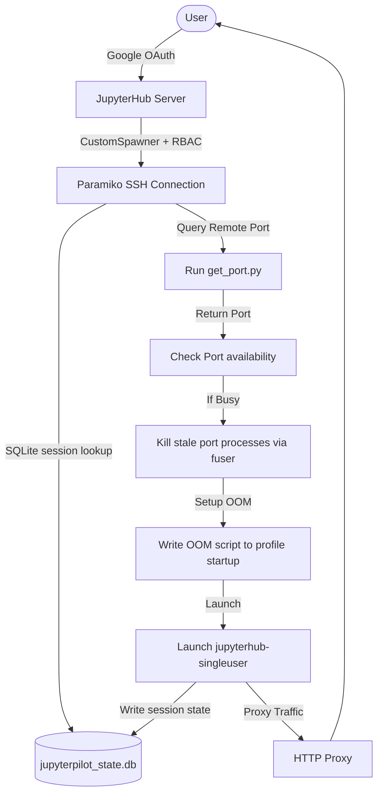
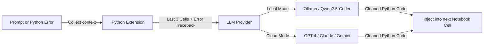

# 🚀 JupyterPilot: Agentic Research & Execution Environment

**JupyterPilot** is a secure, high-performance AI coding partner and isolation spawner designed specifically for enterprise-grade JupyterHub deployments. It decouples the core JupyterHub controller from notebook execution through an SSH-based "teleport" spawner, and provides in-notebook agentic capabilities for natural language coding and real-time traceback healing.

---

## 🗺️ System Architecture

JupyterPilot operates across two layers: **Infrastructure Isolation** (running notebook kernels in distinct user/team servers) and **Notebook Assistance** (in-notebook AI-driven generation).

### 1. Spawning & Isolation Flow
When a user logs in, the Custom Spawner automatically provisions a remote execution process:



### 2. In-Notebook Agentic Loop (`%do` / `%fix`)
Within an active workspace cell, users interact with local or cloud-based AI:



---

## 🏗️ Technical Deep-Dives

### 1. Custom Spawner & Session State ([spawner.py](file:///Users/wajoud/projects/Github/JupyterPilot/spawner.py))
The spawner class `CustomSpawner` extends JupyterHub's `Spawner` class, replacing local process execution with a multi-tenant remote VM infrastructure via `paramiko` SSH:

- **SSH Teleportation**: Resolves user groups on-the-fly and connects to a designated remote server using SSH keys. The `ssh_user` field in the DB overrides the SSH login name per-team.
- **Port Allocation & Conflict Healing**: Queries `python3 ~/get_port.py` on the target remote instance to fetch a port. If `netstat` shows that port is in use, the spawner executes `fuser -k [port]/tcp` and waits for completion before continuing.
- **SQLite Session State**: Writes `{pid, vm_ip, port, start_time, role, status, group_name}` to `jupyterpilot_state.db` after every spawn. `stop()` and `poll()` read this state — enabling **crash recovery** even after a full hub restart.
- **JSON Fallback**: If the SQLite DB is unreachable, the spawner falls back to `user_mapping.json` automatically without crashing the hub.
- **OOM Protection Enforcer**: Generates an IPython startup file on the remote VM that writes `500` to `/proc/self/oom_score_adj` when the single-user server boots.
- **Lifecycle Hook Stubs**: `pre_spawn_hook()` (Task 2: cgroups v2, Task 3: Vault secrets) and `post_stop_hook()` (Task 4: telemetry flush) are ready for future tasks.

### 2. RBAC & Admin Control ([jupyterpilot/admin.py](file:///Users/wajoud/projects/Github/JupyterPilot/jupyterpilot/admin.py))
A 2-tier role model managed entirely through the JupyterHub Admin Panel:

| Role | How set | Rights |
|---|---|---|
| `admin` | JupyterHub Admin Panel or `admin_users` in `hub_settings.json` | Stop/inspect **any** user's session |
| `user` | Everyone else | Only manage **their own** session |

No JSON files, no DB changes, and no restarts are needed to promote a user — the spawner reads `user.admin` directly from JupyterHub at runtime.

### 3. Session Store ([jupyterpilot/session_store.py](file:///Users/wajoud/projects/Github/JupyterPilot/jupyterpilot/session_store.py))
A zero-dependency SQLite wrapper (`sqlite3` stdlib) with two tables:

- **`team_mappings`** — replaces `user_mapping.json` as the primary VM routing source. Seeded from JSON on first deploy via `seed_sqlite.py`.
- **`user_sessions`** — per-user live session record. Survives hub crashes; polled on every `poll()` call.

### 4. AI Extension Engine ([jupyterpilot_extension.py](file:///Users/wajoud/projects/Github/JupyterPilot/jupyterpilot_extension.py))
A lightweight, high-performance IPython extension that integrates directly into the notebook kernel:

- **Context Preservation**: Reads history from IPython's `shell.history_manager.input_hist_raw`. Strips comments, magic commands, and blank cells, sending only the last 3 active cells as context.
- **Traceback Healing (`%fix`)**: Intercepts IPython tracebacks via `sys.last_traceback`, `sys.last_type`, and `sys.last_value`, bundles the failed code with the stack trace, and requests a code-only fix from the LLM.
- **Provider Agnostic Bridge**: Supports dual inference pipelines:
  - **Local**: Direct requests to Ollama endpoints (e.g., `qwen2.5-coder:7b`) for offline privacy.
  - **Cloud**: Integrates `litellm` completions for OpenAI, Anthropic, or Google Gemini.
- **Zero-Explanation Sanitizer**: Strips markdown code blocks from model output, leaving raw, execution-ready code.

---

## 🔒 Security Hardening

JupyterPilot is designed for strict compliance in data-sensitive engineering environments:

* **OAuth Domain Lock**: Hard-restricts authenticated users to an organization-owned Google Hosted Domain (`hosted_domain` in `hub_settings.json`).
* **2-Tier RBAC**: Admin rights are managed exclusively via the JupyterHub Admin Panel — no config file edits required.
* **Impersonation Prevention**: `c.JupyterHub.admin_access = False` prevents admins from jumping into user containers without explicit promotion.
* **Request Blocking Handler (`BlockOtherUsersHandler`)**: A custom HTTP request handler registered at `/user/.*` verifies whether the request path prefix matches the authenticated user's name. Any cross-user directory browsing is blocked with `403 Forbidden`.

---

## 📦 Directory Structure & Component Guide

```
JupyterPilot/
├── spawner.py                      # Custom SSH spawner with SQLite state + RBAC
├── jupyterhub_config.py            # JupyterHub daemon config (loaded at startup)
├── jupyterpilot_extension.py       # Standalone IPython extension (%do / %fix)
├── hub_settings.json               # Network, auth, and DB path config
├── user_mapping.json               # Fallback VM routing (seeded into SQLite on deploy)
│
├── jupyterpilot/                   # Core package
│   ├── admin.py                    # RBACManager — 2-tier role enforcement
│   ├── session_store.py            # SQLite session + mapping store
│   ├── seed_sqlite.py              # CLI: bootstrap DB from user_mapping.json
│   ├── extension.py                # IPython magic command implementations
│   └── provider.py                 # LLM provider bridge (Ollama + LiteLLM)
│
├── src/jupyterpilot/               # Installable package source (pip install -e .)
│   ├── extension.py
│   └── provider.py
│
└── tests/                          # Full mock-based unit test suite
    ├── conftest.py                 # Module mock bootstrap
    ├── test_spawner.py             # Spawner SSH lifecycle tests
    ├── test_config.py              # Hub config & security handler tests
    └── test_spawner_lifecycle.py   # RBAC, SessionStore, crash recovery tests
```

---

## ⚙️ Configuration Files Reference

### 1. `hub_settings.json`
```json
{
    "hub_ip":         "[HUB_IP]",
    "proxy_api_url":  "http://[HUB_IP]:5432",
    "hub_api_url":    "http://[HUB_IP]:8081/hub/api",
    "hub_bind_url":   "http://[HUB_IP]:8081",
    "hub_port":       8000,
    "hosted_domain":  "your-team-domain.com",
    "admin_users":    ["admin_username"],
    "mapping_file":   "user_mapping.json",
    "db_path":        "/var/lib/jupyterhub/jupyterpilot_state.db"
}
```

### 2. `user_mapping.json` (fallback & seed source)
```json
{
    "team_alpha": {
        "server_ip":      "10.0.1.15",
        "server_ssh_key": "/etc/jupyterhub/keys/team_alpha.pem"
    },
    "team_beta": {
        "server_ip":      "10.0.1.16",
        "server_ssh_key": "/etc/jupyterhub/keys/team_beta.pem"
    }
}
```

### 3. `~/.jupyterpilot/config.json` (AI Brain Settings)
```json
{
    "mode": "cloud",
    "local": {
        "url":   "http://localhost:11434/api/generate",
        "model": "qwen2.5-coder:7b"
    },
    "cloud": {
        "provider": "openai",
        "model":    "gpt-4o",
        "api_key":  "sk-proj-..."
    }
}
```

---

## 🛠️ Installation & Verification

### Prerequisites
- Python `3.8` or greater
- System packages on target VMs: `netstat`, `fuser`
- SQLite DB directory writable by the JupyterHub process

### Development Setup
1. Clone the repository and install in editable dev mode:
   ```bash
   pip install -e .[dev]
   ```
2. Bootstrap the SQLite state DB from the JSON mapping (run once on deploy):
   ```bash
   python -m jupyterpilot.seed_sqlite \
       --db  /var/lib/jupyterhub/jupyterpilot_state.db \
       --mapping user_mapping.json
   ```
3. Copy the standalone extension script to your IPython startup folder:
   ```bash
   mkdir -p ~/.ipython/profile_default/startup/
   cp jupyterpilot_extension.py ~/.ipython/profile_default/startup/
   ```

### Running Tests
```bash
pytest -v tests/
```
