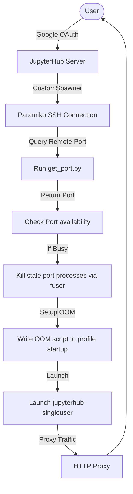
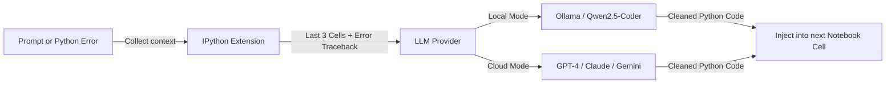

# 🚀 JupyterPilot: Agentic Research & Execution Environment

**JupyterPilot** is a secure, high-performance AI coding partner and isolation spawner designed specifically for enterprise-grade JupyterHub deployments. It decouples the core JupyterHub controller from notebook execution through an SSH-based "teleport" spawner, and provides in-notebook agentic capabilities for natural language coding and real-time traceback healing.

---

## 🗺️ System Architecture

JupyterPilot operates across two layers: **Infrastructure Isolation** (running notebook kernels in distinct user/team servers) and **Notebook Assistance** (in-notebook AI-driven generation).

### 1. Spawning & Isolation Flow
When a user logs in, the Custom Spawner automatically provisions a remote execution process:



### 2. In-Notebook Agentic Loop (`%do` / `%fix`)
Within an active workspace cell, users interact with local or cloud-based AI:



---

## 🏗️ Technical Deep-Dives

### 1. Custom Spawner Internals ([spawner.py](file:///Users/wajoud/projects/Github/JupyterPilot/spawner.py))
The spawner class `CustomSpawner` extends JupyterHub's `Spawner` class, replacing the local process execution model with a multi-tenant remote VM infrastructure using `paramiko` SSH connections:

- **SSH Teleportation**: Resolves user groups on-the-fly and connects to a designated remote server IP mapping using SSH keys.
- **Port Allocation & Conflict Healing**: Queries `python3 ~/get_port.py` on the target remote instance to fetch a port. If `netstat` shows that this port is already in use, the spawner automatically executes a `fuser -k [port]/tcp` command to terminate stale single-user servers from dead sessions.
- **Environment Replication**: Packages necessary environment variables (such as OAuth tokens, API endpoints, and single-user configurations) and passes them safely through the SSH channel.
- **OOM Protection Enforcer**: To prevent runaway notebook memory usage from crashing system-critical daemons, the spawner generates an IPython startup file (`~/.ipython/profile_default/startup/99-admin-oom-enforcement.py`) on the remote VM, which writes `500` to `/proc/self/oom_score_adj` when the single-user server boots.

### 2. AI Extension Engine ([jupyterpilot_extension.py](file:///Users/wajoud/projects/Github/JupyterPilot/jupyterpilot_extension.py))
A lightweight, high-performance IPython extension that integrates directly into the notebook kernel:

- **Context Preservation**: Reads history from IPython's `shell.history_manager.input_hist_raw`. It strips comments, magic commands, and blank cells, sending only the code from the last 3 active cells as state context to the model.
- **Traceback Healing (`%fix`)**: Intercepts IPython tracebacks via `sys.last_traceback`, `sys.last_type`, and `sys.last_value`. The extension bundles the failed code block with the stack trace, sending it to the model with system prompts that request an immediate code-only fix.
- **Provider Agnostic Bridge**: Supports dual inference pipelines:
  - **Local**: Direct requests to local Ollama endpoints (typically running `qwen2.5-coder:7b` for offline privacy).
  - **Cloud**: Integrates `litellm` completions, providing access to OpenAI, Anthropic, or Google Gemini through unified API structures.
- **Zero-Explanation Sanitizer**: Strips markdown code blocks (e.g. ` ```python ` and ` ``` `) from the model's output, leaving raw, execution-ready code.

---

## 🔒 Security Hardening

JupyterPilot is designed for strict compliance in data-sensitive engineering environments:

* **OAuth Domain Lock**: Hard-restricts authenticated users to an organization-owned Google Hosted Domain (`hosted_domain` configuration in `hub_settings.json`).
* **Impersonation Prevention**: In `jupyterhub_config.py`, admin access to individual user containers is explicitly disabled (`c.JupyterHub.admin_access = False`).
* **Request Blocking Handler (`BlockOtherUsersHandler`)**: A custom HTTP request handler registered at `/user/.*` verifies whether the request path prefix matches the authenticated user's name. Any cross-user directory browsing attempts are blocked immediately with `403 Forbidden`.

---

## 📦 Directory Structure & Component Guide

- **[src/jupyterpilot/](file:///Users/wajoud/projects/Github/JupyterPilot/src/jupyterpilot/)**: Core AI extension modules. See the [jupyterpilot/README.md](file:///Users/wajoud/projects/Github/JupyterPilot/src/jupyterpilot/README.md) for extension configurations and prompt structures.
- **[tests/](file:///Users/wajoud/projects/Github/JupyterPilot/tests/)**: Complete mock-based unit tests. See the [tests/README.md](file:///Users/wajoud/projects/Github/JupyterPilot/tests/README.md) for mocking strategies and test commands.
- **[spawner.py](file:///Users/wajoud/projects/Github/JupyterPilot/spawner.py)**: Spawner routing logic to translate group assignments to target machines.
- **[jupyterhub_config.py](file:///Users/wajoud/projects/Github/JupyterPilot/jupyterhub_config.py)**: System configuration file loaded by JupyterHub daemon during startup.

---

## ⚙️ Configuration Files Reference

### 1. `hub_settings.json` (JupyterHub Properties)
```json
{
    "hub_ip": "10.0.0.10",
    "proxy_api_url": "http://10.0.0.10:5432",
    "hub_api_url": "http://10.0.0.10:8081/hub/api",
    "hub_bind_url": "http://10.0.0.10:8081",
    "hub_port": 8000,
    "hosted_domain": "my-company.com",
    "admin_users": ["lead-architect"],
    "mapping_file": "user_mapping.json"
}
```

### 2. `user_mapping.json` (VM Infrastructure Routing)
```json
{
    "team_alpha": {
        "server_ip": "10.0.1.15",
        "server_ssh_key": "/etc/jupyterhub/keys/team_alpha.pem"
    },
    "team_beta": {
        "server_ip": "10.0.1.16",
        "server_ssh_key": "/etc/jupyterhub/keys/team_beta.pem"
    }
}
```

### 3. `~/.jupyterpilot/config.json` (AI Brain Settings)
```json
{
    "mode": "cloud",
    "local": {
        "url": "http://localhost:11434/api/generate",
        "model": "qwen2.5-coder:7b"
    },
    "cloud": {
        "provider": "openai",
        "model": "gpt-4o",
        "api_key": "sk-proj-..."
    }
}
```

---

## 🛠️ Installation & Verification

### Prerequisites
- Python `3.8` or greater
- System packages: `netstat`, `fuser` (installed on target VMs)

### Development Setup
1. Clone the repository and install it in editable dev mode:
   ```bash
   pip install -e .[dev]
   ```
2. Copy the standalone extension script into your IPython startup configurations:
   ```bash
   mkdir -p ~/.ipython/profile_default/startup/
   cp jupyterpilot_extension.py ~/.ipython/profile_default/startup/
   ```

### Running Tests
To run unit tests and verify code modifications without launching virtual servers:
```bash
pytest -v tests/
```
