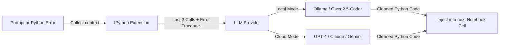

<div align="center">

# 🚀 JupyterPilot

**Enterprise-grade AI coding partner & secure notebook isolation for JupyterHub**

[](https://www.python.org/)
[](https://jupyterhub.readthedocs.io/)
[](LICENSE)
[](tests/)
[](pyproject.toml)

</div>

---

**JupyterPilot** is a secure, high-performance AI coding partner and isolation spawner for enterprise-grade JupyterHub deployments. It decouples the hub controller from notebook execution via an SSH-based "teleport" spawner with SQLite-backed crash recovery, enforces 2-tier RBAC through the JupyterHub admin panel, and provides in-notebook AI assistance through `%do` and `%fix` magic commands.

---

## ✨ Features

| Feature | Description |
|---|---|
| 🔁 **SSH Teleport Spawner** | Launches `jupyterhub-singleuser` on isolated remote VMs per team |
| 🗄️ **SQLite Session State** | Crash-safe session recovery — `stop()` and `poll()` read from DB, not memory |
| 🔐 **2-Tier RBAC** | Admin/user roles managed entirely via JupyterHub Admin Panel |
| 🤖 **`%do` Magic** | Natural language → executable Python injected into the next notebook cell |
| 🩹 **`%fix` Magic** | Auto-heals Python tracebacks using LLM-powered code corrections |
| 🌐 **Provider Agnostic** | Local Ollama (`qwen2.5-coder`) or cloud APIs (GPT-4, Claude, Gemini) |
| 🛡️ **OOM Protection** | Writes OOM score adjustments on remote VMs at spawn time |
| 🔄 **JSON Fallback** | Falls back to `user_mapping.json` if SQLite DB is unreachable |

---

## 🗺️ Architecture

JupyterPilot operates across two layers: **Infrastructure Isolation** and **Notebook AI Assistance**.

### Spawning & Session State Flow


### In-Notebook AI Loop (`%do` / `%fix`)



---

## 📦 Repository Structure

```
JupyterPilot/
├── spawner.py                      # Custom SSH spawner — RBAC + SQLite lifecycle
├── jupyterhub_config.py            # JupyterHub daemon config (loaded at hub start)
├── jupyterpilot_extension.py       # Standalone IPython extension (%do / %fix)
├── hub_settings.json               # Network, auth & DB path configuration
├── user_mapping.json               # VM routing fallback / seed source
│
├── jupyterpilot/                   # Hub-side core package
│   ├── admin.py                    #   RBACManager — 2-tier role enforcement
│   ├── session_store.py            #   SQLite session + team mapping store
│   └── seed_sqlite.py              #   CLI: bootstrap SQLite DB from JSON
│
├── src/jupyterpilot/               # Installable AI extension package
│   ├── extension.py                #   %do / %fix magic command implementations
│   └── provider.py                 #   LLM provider bridge (Ollama + LiteLLM)
│
└── tests/                          # 54-test mock-based unit suite
    ├── conftest.py                 #   Module mock bootstrap
    ├── test_spawner.py             #   SSH lifecycle tests
    ├── test_config.py              #   Hub config & security handler tests
    └── test_spawner_lifecycle.py   #   RBAC, SessionStore & crash recovery tests
```

---

## 🛠️ Installation

### Prerequisites
- Python 3.8+
- Target VMs: `netstat`, `fuser` installed
- Hub machine: writable path for SQLite DB

### 1. Install the package

```bash
git clone https://github.com/wajoud/JupyterPilot.git /opt/jupyterpilot
cd /opt/jupyterpilot
pip install -e .
```

### 2. Configure hub settings

Edit `hub_settings.json`:
```json
{
  "hub_ip":       "10.0.0.10",
  "proxy_api_url":"http://10.0.0.10:5432",
  "hub_api_url":  "http://10.0.0.10:8081/hub/api",
  "hub_bind_url": "http://10.0.0.10:8081",
  "hub_port":     8000,
  "hosted_domain":"your-company.com",
  "admin_users":  ["admin@your-company.com"],
  "mapping_file": "user_mapping.json",
  "db_path":      "/var/lib/jupyterhub/jupyterpilot_state.db"
}
```

Add your team → VM mappings to `user_mapping.json`:
```json
{
  "team_alpha": {
    "server_ip":      "10.0.1.15",
    "server_ssh_key": "/etc/jupyterhub/keys/team_alpha.pem"
  }
}
```

### 3. Bootstrap the SQLite database (run once on deploy)

```bash
python -m jupyterpilot.seed_sqlite \
    --db      /var/lib/jupyterhub/jupyterpilot_state.db \
    --mapping user_mapping.json
```

### 4. Load the AI extension (optional, on worker VMs or user machines)

```bash
# Auto-load in every IPython/Jupyter session
mkdir -p ~/.ipython/profile_default/startup/
cp jupyterpilot_extension.py ~/.ipython/profile_default/startup/
```

Or configure your AI backend at `~/.jupyterpilot/config.json`:
```json
{
  "mode": "cloud",
  "cloud": {
    "provider": "openai",
    "model":    "gpt-4o",
    "api_key":  "sk-..."
  }
}
```

---

## 🔐 Security Model

| Control | Implementation |
|---|---|
| **OAuth Domain Lock** | `hosted_domain` in `hub_settings.json` restricts login to one Google Workspace |
| **Admin Isolation** | `admin_access = False` — admins cannot enter user containers directly |
| **2-Tier RBAC** | `user.admin` from JupyterHub panel; no code changes needed to promote users |
| **Cross-User Blocking** | `BlockOtherUsersHandler` returns `403` on `/user/<other>/` path access |
| **OOM Enforcement** | `oom_score_adj = 500` on remote VMs prevents kernel runaway from crashing system daemons |

---

## 🧪 Running Tests

All 54 tests run without any real SSH, JupyterHub, or database infrastructure:

```bash
# Install dev dependencies
pip install -e ".[dev]"

# Run the full suite
pytest -v tests/

# Individual suites
pytest -v tests/test_spawner_lifecycle.py   # RBAC + SQLite + crash recovery (38 tests)
pytest -v tests/test_spawner.py             # SSH spawner lifecycle (11 tests)
pytest -v tests/test_config.py             # Hub config & security (5 tests)
```

---

## 🗺️ Roadmap

| Task | Status | Description |
|---|---|---|
| **Task 1** — Admin Core & Lifecycle | ✅ Done | SQLite session state, 2-tier RBAC, `start/stop/poll/clear_state` |
| **Task 2** — cgroups v2 Isolation | 🔲 Planned | `systemd-run` wrapping via `pre_spawn_hook` stub |
| **Task 3** — Vault Secret Injection | 🔲 Planned | HashiCorp Vault API key injection at spawn time |
| **Task 4** — Telemetry & Resource Locks | 🔲 Planned | `post_stop_hook` flush to observability backend |

---

## 🤝 Contributing

Contributions are welcome! Please follow these steps:

1. **Fork** the repository
2. **Create a branch**: `git checkout -b feat/your-feature`
3. **Make changes** and ensure tests pass: `pytest -v tests/`
4. **Open a Pull Request** — a code review from [@wajoud](https://github.com/wajoud) will be automatically requested via CODEOWNERS

### Development Setup

```bash
git clone https://github.com/wajoud/JupyterPilot.git
cd JupyterPilot
pip install -e ".[dev]"
pytest -v tests/   # all 54 should pass
```

---

## 📄 License

This project is licensed under the **MIT License** — see the [LICENSE](LICENSE) file for details.

---

<div align="center">

Built with 🔧 by [@wajoud](https://github.com/wajoud) · Star ⭐ if this helps your team!

</div>
