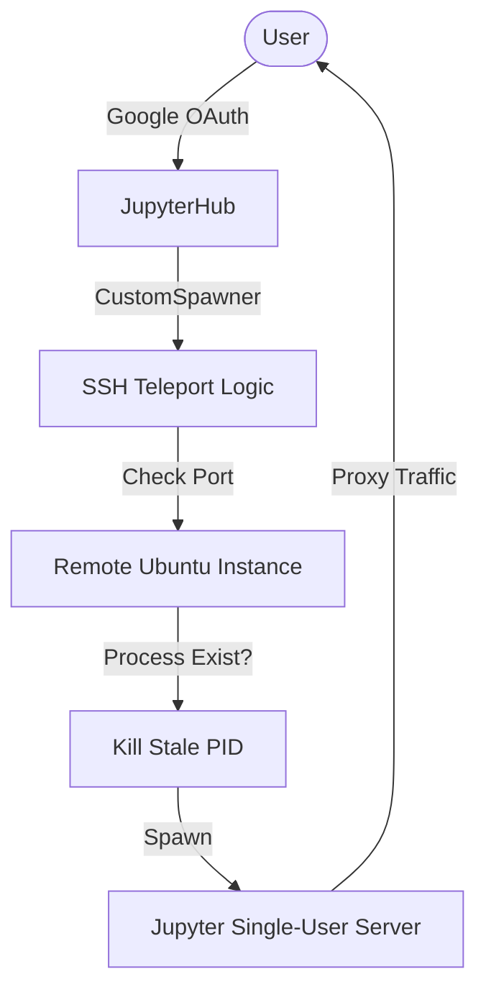
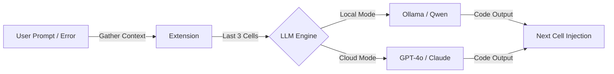

# 🚀 JupyterPilot: Agentic Research Environment

**JupyterPilot** is a secure, high-performance AI coding partner for JupyterHub. It decouples the Hub from execution via an SSH-based "teleport" logic and provides an agentic loop for natural language coding and real-time error healing.

---

## 🗺️ System Flow Diagram

### Infrastructure & Spawning Flow


### Agentic Loop Flow (%do / %fix)


---

## 🏗️ Phase-Wise Implementation

### Phase 0: Robust Infrastructure
The foundation focuses on secure, resilient multi-tenant isolation via SSH.
- **Dynamic Mapping**: Resolves user groups to remote servers via `user_mapping.json`.
- **Port Resilience**: Automated `netstat` checks and `fuser` cleanup before spawning.
- **Graceful SSH Cleanup**: SIGTERM-first shutdown logic for remote resource release.
- **Strict OAuth**: Forced domain enforcement and admin privacy controls.

### Phase 1: Provider-Agnostic LLM Engine
A flexible brain that swaps between local speed and cloud intelligence.
- **Hybrid Support**: Toggle between local **Ollama (Qwen2.5-Coder)** and cloud **LiteLLM (GPT-4o/Claude)**.
- **Hierarchical Config**: Prioritizes `~/.jupyterpilot/config.json` for user-specific choice.
- **High-Performance Inference**: Optimized prompts for zero-explanation, code-only output.

### Phase 2: Interactive Magic Commands
The agentic interface that lives inside your notebook.
- **`%do <prompt>`**: Natural language to code transformation.
- **`%fix`**: Post-mortem error analysis and healing using `sys.last_traceback`.
- **State Awareness**: Maintains variable names and logic flow by injecting the last 3 cells into every prompt.

---

## 🚀 Quick Start

### 1. Global Setup (Admin)
Configure the Hub in [hub_settings.json](file:///Users/wajoud/projects/Github/JupyterPilot/hub_settings.json):
```json
{
    "hub_ip": "[HUB_IP]",
    "hosted_domain": "your-team.com",
    "mapping_file": "user_mapping.json"
}
```

### 2. User Setup (Individual)
Configure your LLM preference in `~/.jupyterpilot/config.json`:
```json
{
    "mode": "local",
    "local": {
        "model": "qwen2.5-coder:7b"
    }
}
```

### 3. Enable Magics
Install the extension in your IPython startup folder:
```bash
cp jupyterpilot_extension.py ~/.ipython/profile_default/startup/
```

---

## 🛠️ Usage

| Command | Action | Description |
| :--- | :--- | :--- |
| `%do <prompt>` | **Code Generation** | Converts instructions to code in the next cell. |
| `%fix` | **Error Healing** | Analyzes the last traceback and provides a fix. |

---

## 🔒 Security & Privacy
- **SSH Isolation**: Each user is "teleported" to a dedicated or team-specific remote instance.
- **No Admin Peeking**: Admins are blocked from accessing user servers by default.
- **Decoupled Configuration**: Sensitive IPs and keys are kept in centralized, non-hardcoded JSON files.

---

## 📄 License
MIT License. Created for high-performance, secure Data Science teams.
